Cyon, Alexander: Husband, father, HoMM3 & Chess player, Rust & Swift lover, cryptography enthusiast and OSS author.

I offer consulting services either through B2B or EOR, I specialize in SDK/middleware for cryptographic applications such as wallets, DLT (blockchain), encryption, [Mozilla UniFFI](https://github.com/mozilla/uniffi-rs). I am also an expert at iOS app development. If are interested in my services you can contact me at: alex [at] cyonconsulting [dot] com

---

---

---

---

<!-- my-badges start -->

<!-- my-badges end -->
